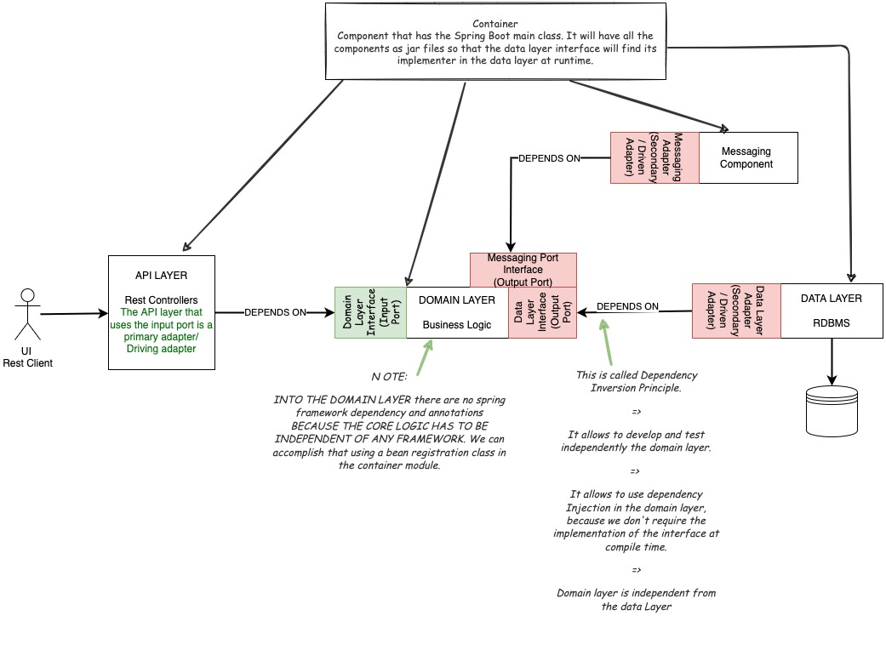
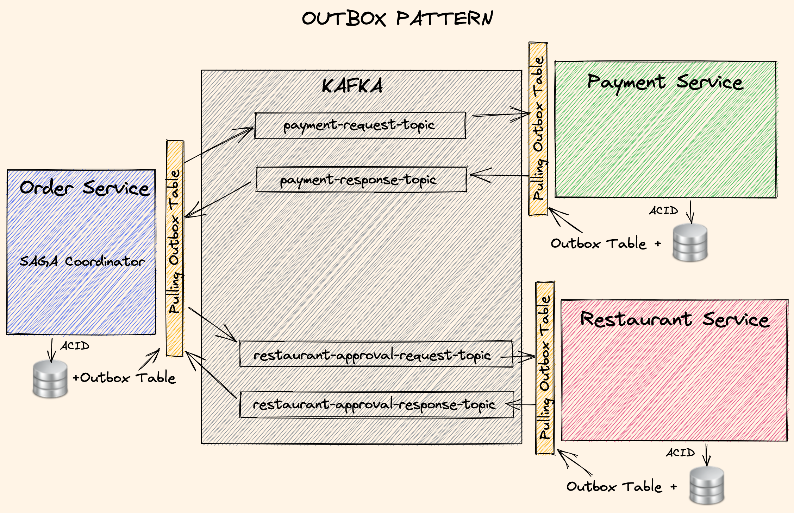
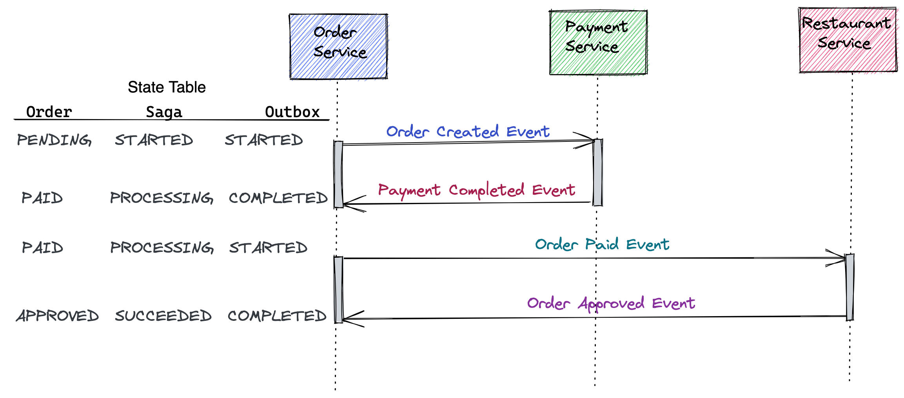
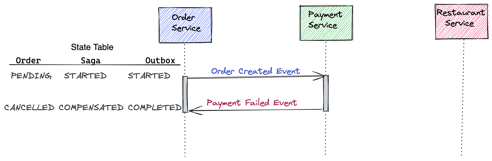
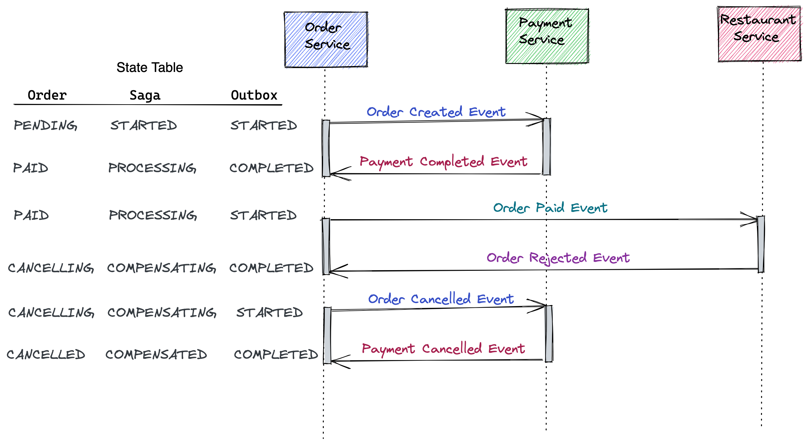
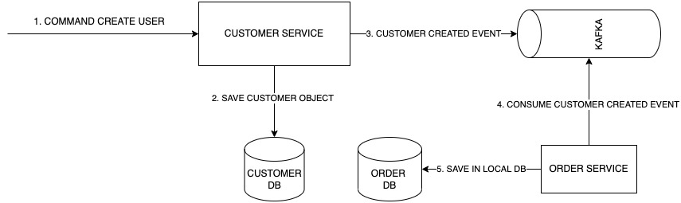
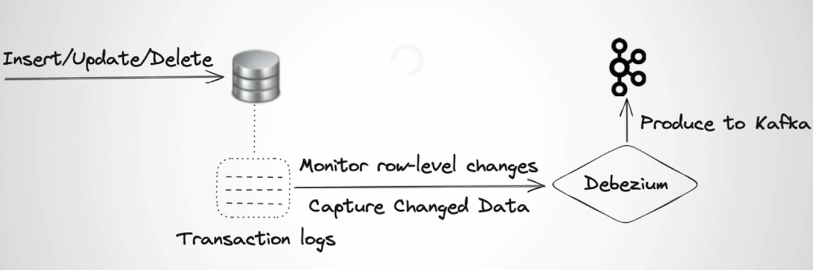
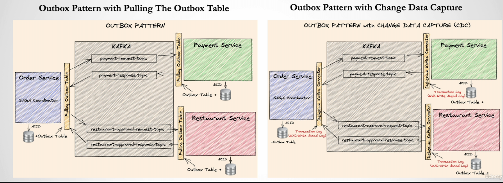

# EVENT DRIVEN MICROSERVICES  ADVANCED

## CLEAN ARCHITECTURE FOR ORDER-SERVICE



## DOMAIN DRIVEN DESIGN (DDD) FOR ORDER-SERVICE


## ORDER STATE TRANSITIONS


## OUTBOX PATTERN



### OUTBOX HAPPY FLOW



### OUTBOX PAYMENT FAILURE



### OUTBOX APPROVAL FAILURE



## CQRS



Yes, there is not strong consistency between local database operations and data publishing operation for the customer service, outbox pattern implementation can fix that.

## CHANGE DATA CAPTURE (CDC)

- Use Push method as opposed to Pulling

- Push database records into target source (Kafka) by reading from Transaction Logs (WAL in Postgres)

  

  Will be replacing the scheduler written in Java:

  

## API USAGE

1. POST request to http://localhost:8184/customers with JSON body:

```json
{
    "customerId":"d215b5f8-0249-4dc5-89a3-51fd148cfb41",
    "username": "user_1",
    "firstName": "Armando",
    "lastName": "Maradona"
}
```

2. POST request to http://localhost:8181/orders  request to with JSON body:

```json
{
  "customerId": "d215b5f8-0249-4dc5-89a3-51fd148cfb41",
  "restaurantId": "d215b5f8-0249-4dc5-89a3-51fd148cfb45",
  "address": {
    "street": "street_1",
    "postalCode": "1000AB",
    "city": "Amsterdam"
  },
  "price": 200.00,
  "items": [
    {
      "productId": "d215b5f8-0249-4dc5-89a3-51fd148cfb48",
      "quantity": 1,
      "price": 50.00,
      "subTotal": 50.00
    },
    {
      "productId": "d215b5f8-0249-4dc5-89a3-51fd148cfb48",
      "quantity": 3,
      "price": 50.00,
      "subTotal": 150.00
    }
  ]
}
```

3. Get the orderTrackingId from the response and query the result with a GET operation to http://localhost:8181/orders/toChangewithOrderTrackingId

You will see that first is PAID (payment-service replied), and roughly after 10 seconds, it is APPROVED (restaurant-service confirmed) if you continue to perform GET operation. Notice that if you perform the previous POST operation multiple times, it will fail, because there are not enough funds, and this can be an example of bad path.

## HOW TO LAUNCH THE SERVICES

0. Run Docker and Kubernetes

1. [Install helm](https://helm.sh/docs/intro/install/).

2. Type in terminal:

    ``` bash
    helm repo add my-repo https://charts.bitnami.com/bitnami
    helm install my-release my-repo/kafka
    helm install schema my-repo/schema-registry
    ```

3. From the project's root type in terminal: ```mvn clean install```

4. Go from terminal in the folder Event-Driven-Microservices-Advanced/infrastructure/k8s and type: ```kubectl apply -f kafka-client.yml```

5. Once the pod is running type in terminal: ```kubectl exec -it kafka-client -- /bin/bash ```

6. Once in the container, let's create the topics needed for running the applications: 

   ```bash
   kafka-topics --bootstrap-server my-release-kafka:9092 --create --if-not-exists --topic payment-request --replication-factor 1 --partitions 3
   kafka-topics --bootstrap-server my-release-kafka:9092 --create --if-not-exists --topic payment-response --replication-factor 1 --partitions 3
   kafka-topics --bootstrap-server my-release-kafka:9092 --create --if-not-exists --topic restaurant-approval-request --replication-factor 1 --partitions 3
   kafka-topics --bootstrap-server my-release-kafka:9092 --create --if-not-exists --topic restaurant-approval-response --replication-factor 1 --partitions 3
   kafka-topics --bootstrap-server my-release-kafka:9092 --create --if-not-exists --topic customer --replication-factor 1 --partitions 3
   ```

7. While still inside the container let's verify that all 5 topics have been created with: ```kafka-topics --zookeeper my-release-zookeeper:2181 --list```
8. Exit from the container and from the folder Event-Driven-Microservices-Advanced/infrastructure/k8s , type: ```kubectl apply -f postgres-deployment.yml ```
9. Wait that postgres is running and after type: ```kubectl apply -f application-deployment-local.yml```
